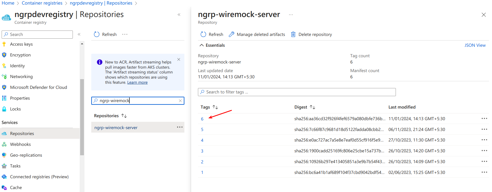

# wiremock-server
A standalone web server designed to provide simulated responses for external API requests.

## Deploying the Mock Server to a Cluster from Local
To deploy to a cluster from your local environment, follow the steps below, mimicking the build and release pipeline.

1. Build the local Docker image:

    `docker build . -t ngrp-wiremock-server`

2. Log in to Azure:

   `az login`

3. Log in to Azure Container Registry:

    `az acr login --name ngrpdevregistry --username ngrpdevregistry --password <password>`

4. Find the latest image tag from the Azure Portal and increment the tag number.
   

5. Tag the local image with the new tag:

    `docker tag ngrp-wiremock-server:latest ngrpdevregistry.azurecr.io/ngrp-wiremock-server:7`

6. Push the image to the registry:

    `docker push ngrpdevregistry.azurecr.io/ngrp-wiremock-server:7`

7. Connect to the cluster:

    `az aks get-credentials --resource-group ngrp-dev --name ngrp-dev-east-us-cluster --subscription NGRP-Dev`

8. Update `deployment.azure.yml` to reflect the newly pushed image at the specified line:
   
    From `image: ngrpdevregistry.azurecr.io/ngrp-wiremock-server:#{Build.BuildId}#`

    To `image: ngrpdevregistry.azurecr.io/ngrp-wiremock-server:7`

9. Deploy to the cluster:

    `kubectl apply -f deployment.azure.yml`
